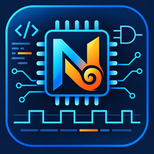

> ZHDL is a fork of [TerosHDL](https://github.com/TerosTechnology/vscode-terosHDL), modified and maintained by `narutozxp`.

**English** | [简体中文](README_zh-CN.md)

# ZHDL



A VS Code extension for ASIC and FPGA development, with Verilog, SystemVerilog and VHDL editing, project management and tool integration.

## Version 8.0.10

- Independent ZHDL configuration, project storage, output channels, commands and views.
- Indexing scope and experimental live parsing configured through **Open Global Settings Menu → General**, with clearer English labels and aligned controls.
- English main README and a [Chinese README](README_zh-CN.md), including configuration migration, performance limits and remaining TODOs.
- Removed the temporary diagnostic launch configurations and runtime hooks. Use **Run ZHDL** for local debugging.

After upgrading, import old settings if needed and update custom keybindings to the new command names. See [Configuration file locations](#configuration-file-locations).

## Current development changes (unreleased)

- Incremental edit transport and text storage, with local extraction for assignments, declarations, module headers and affected modules.
- Unsaved interfaces from other open project members are available to module and port completion; improved virtual-document handling and symbol ranges.
- Smaller offline package: development-only dependencies and unused SQL.js builds are excluded, duplicate rendering resources are shared, and obsolete documentation assets are removed.
- Added edit/undo, lifecycle and large-input regressions, plus an offline check for extracted VSIX packages.

## Features

- Syntax highlighting, snippets and template generation.
- Verilog and SystemVerilog keyword and symbol completion.
- Go to definition, hover information, hierarchy and dependency views.
- Syntax checking, Verible style checking and code formatting.
- HDL documentation, schematic viewing and state machine tools.
- Integration with simulation and synthesis tools, including GHDL, Verilator, Icarus Verilog, Yosys, Vivado, Quartus, VUnit and cocotb.

## Changes in this fork

- Language-specific Verilog and SystemVerilog keyword completion.
- Completion requests return even when ctags has not indexed the current file.
- Installation paths and version information come from the current extension context, allowing the extension name and publisher to change.
- Opening the settings menu again brings the existing settings page to the front.
- The ctags outline is retained to avoid duplicate symbols from Verible.
- A ctags hover provider is enabled when Verible does not support hover.
- Completion labels show signal types and widths. Ports show direction, type and width, such as `input wire [WIDTH-1:0]`. Outline entries show the same signal details; instances show their module name and use the Field icon.
- Ports and variables are filtered by the module containing the cursor. Module names and keywords remain available.
- Per-file symbol caches share concurrent requests and update after saves or disk changes. Project indexing reparses only changed files.
- Cross-file module completion, instantiation templates, named port and parameter completion, and hierarchical port completion.
- Separate ZHDL names for configuration files, project lists, build directories, output channels, commands and views.

## Module instantiation and port completion

The index first uses the ZHDL project containing the current file. Without a matching project, it defaults to the currently open Verilog and SystemVerilog files. Opening multiple files enables module completion between them; closing a file removes its modules from that index.

Configure indexing and live parsing under **Open Global Settings Menu → General**. Both settings are stored under `general.general` in `~/.zhdl_config.json`:

```json
{
  "general": {
    "general": {
      "indexing_scope": "openFiles",
      "live_parsing": false
    }
  }
}
```

`indexing_scope` defaults to `openFiles`. Select `workspace` to index the VS Code workspace folder containing the current file. Scanning includes `.v`, `.sv`, `.vh` and `.svh`, excluding `node_modules`, `.git`, `out`, `dist` and `build`. A file outside a workspace is indexed on its own.

Saving through the global settings menu applies changes immediately. Reload the window after editing the configuration file directly. Fields with the same names in project settings do not override these global settings.

The JSON above shows only the relevant fields; preserve other settings when editing your file. The old VS Code settings `zhdl.indexing.scope` and `zhdl.indexing.liveParsing` are no longer read. You can remove them from `settings.json` and configure the options in ZHDL's global settings menu.

On a blank line inside a module body, type a module name and select its completion to generate an instance with named parameters and ports. Each port has an aligned direction and width comment, such as `// input [WIDTH-1:0]`. Single-bit ports show `[0:0]`; custom types with an undetermined width show `width unknown`. Use **Tab** to edit the instance name, followed by parameter values and port connections.

Type `.` in an existing instance's connection list to complete unconnected ports, or in its `#(...)` parameter override list to complete parameters. Type `u_instance.` to complete the instance's module ports. Inside a `.port(...)` expression, completion uses signals from the current module.

Saved ctags symbols and disk module interfaces update after saves or disk changes. The current file's module interface and completion context are read from the editor buffer. With live parsing enabled, other open, unsaved project members also supply their current interfaces, including `.vh` and `.svh` members. Clean files reuse saved indexes, and unrelated open files are excluded. Indexing parses syntax without HDL preprocessing or elaboration, so macro-generated interfaces may be incomplete. Initial completion waits for project indexing; later requests reuse the cache.

### Incremental completion for unsaved changes (experimental)

Select **Enable live parsing (experimental)** on the global settings **General** page (`live_parsing`). It updates unsaved Verilog and SystemVerilog signal completion and Outline entries, and is disabled by default.

Editing triggers updates through document-change events, with a 30–100 ms adaptive coalescing delay and a maximum scheduled wait of 150 ms from the first edit in a batch. Completion, Outline and project-interface requests submit pending updates immediately. These are scheduling delays; Worker queuing and execution add to the time before results appear. There is no periodic polling.

Open files share an on-demand background Worker. Normal edits send changed ranges and inserted text, retaining previous syntax trees and updating the affected symbols. Each file has at most one request in flight; edits arriving during parsing are accumulated and processed to reach the latest version. Closing files releases their states and skips queued work; closing all tracked files terminates the Worker. Already executing WASM work cannot be individually interrupted.

Safe assignment edits avoid traversing surrounding declarations. Declarations, procedural items, functions/tasks and generate edits use local extraction where possible. ANSI port and unchanged-name header parameter edits can extract only the module header. Parameter identity changes and non-ANSI interface coordination can require affected-module extraction; design-unit boundary changes and syntax-error recovery may require full extraction. A full extraction does not necessarily mean sending the full text again.

The live symbol set mainly covers modules, ports, registers, nets, instances and constants. Other ctags kinds still come from available saved caches and may be stale while editing. Function/block visibility is not yet a complete SystemVerilog scope model. Virtual documents support local live completion and Outline, but do not have the full file-based project index. Macros and includes are not expanded: editing a header does not reliably invalidate all referring files' preprocessed semantics. Disabling the option restores saved-file symbol completion.

A local benchmark used Node.js 25.8.1 and a synthetic module with 10,000 declarations (about 229,050 UTF-16 characters). The following values are medians over 10 edits, including Worker execution, message transfer and client delta merging. They exclude the scheduling delay, initial project indexing, complete completion-item construction and VS Code rendering:

| Edit | Request round-trip median |
|---|---|
| Declaration width | 10.44 ms |
| Procedural assignment expression | 7.81 ms |
| ANSI port direction | 9.38 ms |
| Header parameter default | 11.97 ms |
| Generate condition | 9.10 ms |

First analysis, including Worker startup, was about 693 ms in a single measurement. A separate 100-module file with 100 declarations per module took about 7.28 ms for a body-parameter edit; this does not predict the cost of editing a parameter in one huge module. Continuous edits in these cases required no full-text reads by the Buffer service. The completion provider itself still reads text to identify context.

The regression matrix covers 122 edit categories and their undo operations, with additional checks for version recovery, document lifetimes, Unicode coordinates, deep nesting and large declarations. Comparison with a fresh parse validates incremental consistency, not complete HDL compiler semantics. Peak memory and end-to-end UI performance on large real projects remain to be established, so live parsing stays experimental and disabled by default. See the [architecture review and remaining limitations](docs/live_parsing_review.md).

### Lint diagnostic updates

Once the selected linter is configured and enabled, edits trigger diagnostic updates without requiring a save. Edit events are currently coalesced for about 250 ms; opening and saving files also trigger checks. External lint tools generally process the complete content, so their costs are separate from Tree-sitter incremental completion. Tool paths, enablement and execution time affect when diagnostics appear.

## Bundled tools

- Verible LSP: `v0.0-4219-g3275ab72`, with Linux x86_64 and Windows x64 binaries.
- Universal Ctags: `6.2.0 (ab95af1)`, from the official 2026-09-16 nightly build, with Linux x86_64, macOS Intel and Windows x86 binaries.
- Versions, download sources and SHA-256 checksums are recorded in `server/binaries.json`. Run `python3 server/update_binaries.py` to reinstall the pinned versions. Update the manifest when changing versions.

## Offline use and package size

Built-in parsers, Yosys, Pyodide, SQL.js, Python wheel files and bundled native tools remain in the VSIX; this cleanup introduces no runtime downloads. Install a compatible VSIX in the environment running the extension. For Remote SSH, WSL and containers, local tool paths and binary compatibility refer to that remote environment. External tools such as GHDL, Verilator, Vivado and Quartus must already be installed and configured to use their integrations offline. Online documentation and additional package downloads still need a connection.

The measured package contents decreased from about 290 MiB to 182 MiB uncompressed (about 37%); a test VSIX was about 51.2 MiB compressed. This is a local build measurement, not a guarantee for every release. The change removes development-only dependencies, unused SQL.js variants, duplicate rendering libraries and obsolete documentation resources. Existing icons and offline runtime resources are retained. See the [package cleanup record and verification scope](docs/package_cleanup.md).

## Configuration file locations

Global settings and project data are stored in the home directory of the user running the extension:

| File | Purpose |
|---|---|
| `~/.zhdl_config.json` | Global settings, including tool paths, linters, formatting and indexing |
| `~/.zhdl_prj.json` | Project list and project data |

On Linux and macOS, `~` is the current user's home directory. On Windows it corresponds to `%USERPROFILE%`, for example `C:\Users\yourname\.zhdl_config.json`. With Remote SSH, WSL or containers, these files are in the home directory of the remote or container user running the extension.

ZHDL uses these files independently and no longer automatically reads or writes TerosHDL's `~/.teroshdl2_config.json` and `~/.teroshdl2_prj.json`. When switching to independent settings, configure tool paths again or use **Load Settings** in ZHDL's global settings menu to import the old `.teroshdl2_config.json`. Imported settings are saved to ZHDL's own configuration file. You can also use **Export Settings** to create a backup.

To migrate the old project list, close the relevant extension hosts, back up any existing `.zhdl_prj.json`, and copy `.teroshdl2_prj.json` to `.zhdl_prj.json`. The project format remains compatible; the original file can remain in place. The two copies are maintained independently after migration.

The default tool build directory is `~/.zhdl/build`. Temporary files in the home directory use the `.zhdl_` prefix, and workspace caches use the extension's own storage directory. The installation-state file, `user.zhdl.config.json`, is stored in the extension installation directory and records installation and version state rather than global tool settings.

The Output channels are **ZHDL: Global**, **ZHDL: Tool Manager** and **ZHDL: Debug**. Commands and project views use independent `zhdl` identifiers. Update custom keybindings referencing `teroshdl.*` commands to the corresponding `zhdl.*` names.

## Local development

Requirements: Node.js 22, npm, Python 3 and Git. In the repository root, run:

```bash
npm install
npm run compile
```

In VS Code's **Run and Debug** panel, select **Run ZHDL** and press **F5** to launch the extension development host. This starts a compilation watcher. After source changes compile, run **Developer: Reload Window** in the development host.

Checks and tests:

```bash
npx tsc -p ./ --noEmit
npm test
npm run lint
```

Run the language service and parser regression tests separately with:

```bash
npm run compile
node node_modules/jest/bin/jest.js tests/teroshdl tests/parser --runInBand --coverage=false --reporters=default
```

Worker tests use compiled files under `out`, so compile before testing source changes. `npm run compile` already copies resources and builds both Webview bundles; you do not need to run those steps individually.

Build a VSIX with VSCE installed:

```bash
npm install -g @vscode/vsce
npm run package
```

Packaging runs the existing example-refresh and compilation steps; refreshing upstream examples requires Git/network access during the build. This is separate from running the installed extension offline. Extract the resulting VSIX and validate its bundled resources with:

```bash
node tests/packaging/offline_smoke.cjs /absolute/path/to/extracted/extension
```

The check uses the extracted package, blocks Node network APIs (also in parser workers), and exercises SQLite, YAML, parsing, Graphviz, basic Python/stdlib, Yosys and Webview resource bindings. It is not a complete VS Code UI or operating-system network-isolation test.

To check keyword completion, open and save a `.v` or `.sv` file and confirm its language mode is Verilog or SystemVerilog. Type prefixes such as `alw` or `pos` and press `Ctrl+Space`. SystemVerilog files should also offer `always_ff`, `always_comb` and `logic`.

## TODO

- [ ] Cache declaration contributions within modules and improve local recovery to reduce remaining module/full extraction after parameter identity changes, non-ANSI interface edits and syntax errors.
- [ ] Build a finer scope graph and extend the live symbol set for SystemVerilog functions, tasks, classes, interfaces and packages.
- [ ] Extract disjoint edit intervals separately; evaluate lazy positions to reduce remaining linear symbol and line-index updates.
- [ ] Unify saved-file, editor-buffer and project parsing caches to avoid duplicate work and move expensive initial project analysis off the extension's main thread.
- [ ] Use unsaved symbols for hover and go to definition, sharing versions and scopes across consumers; add preprocessing and transitive macro/include dependency invalidation.
- [ ] Add project/WASM memory budgets, cache eviction and task priorities for large and multiple files. Test prolonged editing, repeated opening and closing, rapid edits and actual UI response before considering enabling live parsing by default.
- [ ] Evaluate platform-specific offline packages and extension bundling while preserving dynamic loads, Worker entry points and runtime resources.
- [ ] Rebuild and validate compatible HDL WASM grammars before upgrading `web-tree-sitter`, and migrate its APIs and imports. The existing WASM binaries could not be used directly with the tested newer version.
- [ ] Bound per-file lint concurrency, discard stale diagnostics, and improve cancellation, timeouts, exception handling and temporary-file cleanup; evaluate configurable refresh delays.
- [ ] Verify Axios `navigator` compatibility in the extension host and evaluate lazy loading for optional tools such as Sandpiper.
- [ ] Continue investigating development window exits with client logs, actual telemetry call stacks, isolated startup, debugger network inspection disabled, and long-term memory and connection monitoring.
- [ ] Add a migration wizard for old settings and project lists, including confirmation, backups and error reporting.
- [ ] Improve test isolation and resource cleanup. Configuration, project management and parsing regressions pass in separate groups, but combined runs have encountered parsing timeouts, and configuration tests retain open handles after finishing.

## Documentation and feedback

- [Live parsing architecture, benchmarks and limitations](docs/live_parsing_review.md)
- [Offline package cleanup and checks](docs/package_cleanup.md)
- [Repository documentation](docs/)
- [Report an issue](https://github.com/narutozxp/vscode-terosHDL/issues)
- [Upstream TerosHDL documentation](https://terostechnology.github.io/terosHDLdoc/) for shared features.

## Acknowledgments

Thanks to [Teros Technology](https://github.com/TerosTechnology) and the [TerosHDL maintainers and contributors](https://github.com/TerosTechnology/vscode-terosHDL). This project's foundational features and architecture come from their open-source work.

## License

This project retains the upstream [GNU GPL v3 license](LICENSE). Original author copyright notices are preserved.
