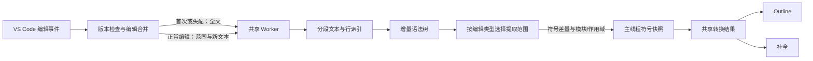

# Live parsing 架构评估与优化

评估日期：2026-09-18。范围：当前仓库的 Verilog/SystemVerilog 实时解析、补全、Outline 和模块模型。

## 架构结论

原实现只在语法树层面增量化。外围链路仍包含每次发送全文、扫描全文寻找差异、重新构造行索引、Worker 与主线程分别维护整份符号表，以及多个消费者重复转换符号和扫描作用域。这些成本会随文件大小、符号数和请求次数叠加。

增量化已扩展到输入、状态、提取和消费四层。提取按无声明赋值表达式、注释/空白、受影响语法项、模块头、受影响模块和整文件分层；参数身份变化、设计单元边界变化和错误恢复保留保守路径。配置默认值不变。



## 主要实现

### 1. 版本化编辑流

`ProjectLanguageService` 直接将 `contentChanges` 交给 Buffer 服务。首次请求同步全文；连续版本的正常编辑只发送 UTF-16 范围、新文本和 Tree-sitter 坐标，直接应用 `tree.edit()`，不再反向扫描全文寻找差异。

同一事件的多光标范围基于旧文档坐标，从右到左应用；多个事件按时间顺序合并。解析进行中的编辑继续累计，当前请求完成后再处理最新版本。每个文件最多一个在途请求。在途请求负责继续消费新编辑，因此编辑事件不再为同一文件创建额外解析定时器。

Worker 重启、丢失文件状态、版本或坐标失配、缺少事件，以及超过 128 个编辑或 64 Ki 字符的批次，都会重新同步全文。失配回复不作为正常快照使用。

### 2. 分段文本输入与增量行索引

新增 `BufferText`。编辑只替换分段描述和新增文本；解析器按需读取最多 4 Ki 字符的片段，节点文本查询读取精确范围。正常局部提取无需拼接整份新文本。

旧语法树保留自己的不可变文本视图，避免新编辑破坏旧节点文本。行起点保留在文档状态中，更新只检查新增文本并调整受影响行；等长、无换行修改直接共享行索引。

分段超过 64 段，或保留的 backing 文本超过 `2 × 当前文本长度 + 65,536` 字符时压缩。压缩强制创建独立 UTF-16 存储，避免 V8 的切片字符串继续引用大型旧文本，也保留暂时拆开的代理项。该预算约束文本存储，不代表整个 Worker 堆或 WASM 的内存上限。

### 3. 单份符号快照与扩大局部提取

Worker 状态只保留文本、语法树、模块模型和作用域，完整符号数组只在首次或完整提取时临时构建并发送。之后返回变化区间和新增符号，由主线程统一合并；消除 Worker 对整份符号表的重复过滤、复制和去重。

主线程符号按位置排序，用线性合并代替整表字符串哈希；无需位移的记录保持对象身份，合并仅分配最终结果数组。

局部提取扩展到 always、initial、函数、任务及 generate 块，重新收集受影响项的声明和过程范围。模块头、参数和端口采用下文所述分层提取；设计单元边界变化及受影响单元的语法错误仍保守回退。共享声明的显示信息一次提取全部名称，避免每个名称重新解析同一声明。

完整提取时按模块位置建立节点索引，并把已知符号检查限制到当前模块，避免多模块文件反复扫描全局结果。通用模块模型提取只访问头部前缀，并将四次过程节点查询合并为一次。

### 4. 基于结果变化复用消费者视图

普通模块文件的补全作用域直接由已有语法树生成，避免再次词法扫描全文；混合设计单元、嵌套单元或错误输入采用原有词法恢复。局部编辑只更新作用域位置，补全消费共享结果，不再每个文档版本在主线程全文扫描。

`FileSymbolCache.getBuffer()` 返回带版本的轻量实时视图，不再为了 Outline 读取整份文档。补全使用自己已捕获的当前文本；保存文件快照仍携带保存时文本，供保存文件的补全和悬停使用。

同一文档版本的并发消费者共享 Promise 和转换结果；未改变的原始记录共享 VS Code 符号对象。对于等长、无行号变化且新旧区间都没有声明的表达式修改，保留整份符号数组，继续复用转换数组与 Outline 层级。声明删除和位置变化会使该复用失效。

转换结果和 Outline 以 WeakMap 缓存；关闭文件或禁用功能时显式清理该文档实时视图和 Buffer 状态。Outline 同时保留解析失败时的保存符号回退，以及等待期间文档版本变化时的过期结果丢弃。

## 性能对比

基线为**上一轮已优化版本**，即本轮架构修改前的编译产物，不是原始 Git HEAD。环境为仓库现有依赖、Node.js v25.8.1。本地顺序运行相同基准；连续编辑各 10 次，报告中位数。

主样例为一个模块、10,000 条声明和一个 always 块，约 228,971 个 UTF-16 字符。计时包括编辑事件处理、Worker 往返及主线程差量合并，不包含 VS Code UI 渲染或完整补全项构造。

| 场景 | 架构修改前：服务往返 | 架构修改后：服务往返 |
| --- | --- | --- |
| 文本相同，仅版本变化 | 0.48 ms | 0.20 ms |
| 修改一条声明位宽 | 25.23 ms | 10.41 ms |
| 修改过程块中的表达式 | 349.60 ms | 8.03 ms |
| 一个声明包含 1,000 个名称 | 903.38 ms | 13.11 ms |
| 首次解析，包括初始化 | 759.47 ms | 728.76 ms |

首次解析和共享声明为单次测量，其余为 10 次的中位数。首次解析仍需处理全文并初始化，单次耗时有波动，尚不能保证稳定降低；主要改善连续编辑的传输、提取和结果消费成本。数字来自本地样例，不能替代真实工程的扩展宿主测量。

10 次连续声明编辑的纯文本载荷从 **2,289,715 字符降为 55 字符**；10 次过程块编辑从 **2,289,710 字符降为 10 字符**。正常编辑阶段 Buffer 服务不调用 `document.getText()`。这不包含协议字段和模块模型等其他载荷；完整补全本身仍需要当前文本。

### 编辑类型评估与分层优化

增加了 **122 类编辑及其撤销**的真实 Worker 对照矩阵（原 52 类，加本轮 70 类边界输入），并单独测试异常状态、编辑合并和跨文件消费。对照对象是同一语法提取器对最新文本首次解析的结果，不代表经过完整 HDL 编译器验证，也不证明宏/类型等尚未支持的语义。参数声明位置、继承默认值、符号数量及位宽另有独立断言，避免同一提取器的共同错误逃过对照。

| 编辑类型 | 当前策略与边界 |
| --- | --- |
| 文本不变，仅版本增加 | 复用快照，不解析；正常事件不传文本 |
| 模块外注释/空白 | 校验设计单元边界不变，更新位置，不提取模块体；插入真实代码会升级策略 |
| 模块体内注释/空白、格式化 | 定位相邻语法项；空白使用二分定位，避免创建整个子节点列表；范围接触上下文声明时升级为模块提取 |
| reg/wire/logic、类型修饰、位宽、数组、初始化、共享声明增删改 | 提取受影响语法项并发送差量；类型名和枚举等超出现有实时种类的语义仍有限 |
| 表达式、赋值、过程块、always_ff、函数/任务内声明 | 局部提取与过程范围更新；符合条件的表达式修改复用符号数组 |
| 实例类型、名称、参数表达式、连接 | 局部实例提取；项目查询读取其他已打开成员文件的未保存接口 |
| generate 条件、块名、局部声明、循环 | 局部提取；包含参数/端口等上下文声明时升级为受影响模块提取 |
| ANSI 端口方向、增删、继承类型；模块名称/属性 | 单独解析小型模块头，复用未变的模块体；改名差量同步更新体内符号所属模块 |
| 头部参数默认值 | 参数名称集合不变时只提取模块头，保留模块体参数 |
| 头部参数名称增删、改名、类型参数；模块体参数 | 提取受影响模块，防止丢失原先被头部参数遮蔽的体内默认值；语法不被 bundled grammar 接受时仍采用错误恢复 |
| non-ANSI 端口、外部端口名称与体内声明 | 提取受影响模块，协调头部顺序与体内方向、位宽、名称 |
| 模块头和模块体同时修改；多模块编辑批次 | 设计单元边界保持时仅提取覆盖区间内的模块；区间中未直接编辑的模块可能被一起提取 |
| 模块增删、拆分、合并；package/interface/program 插入；结束标签 | 边界校验决定模块或整文件提取；复杂作用域保留词法扫描 |
| 临时语法错误、恢复、撤销 | 受影响模块有错误时采用完整恢复；其他模块存在错误不阻止清晰模块的局部体编辑 |
| 多光标、连续事件、解析中继续编辑、漏事件、Worker 重启 | 版本化编辑合并；失配或预算超限时同步全文；在途请求负责追赶版本，避免额外定时器和等待者 |
| `.vh/.svh` 文件中的模块接口 | 其他已打开项目成员文件的未保存模型会覆盖磁盘模型；关闭后恢复保存索引；项目之外的打开文件不混入 |
| include、宏定义/引用、条件编译 | 已测试编辑/撤销后的原始语法结果一致性；**尚无 include 依赖图及完整预处理语义** |
| typedef、struct、enum、包导入和其他 ctags 种类 | 已检查编辑传输与原始提取的一致性；当前实时支持集合之外的保存符号仍可能过期 |
| VHDL 和其他语言 | 不进入该 Verilog/SystemVerilog Worker，沿用现有路径；本轮未重构其解析器 |

端口及公开参数的位置直接来自 AST 声明标识符，以 WeakMap 附加到模块模型，不再逐名称搜索模块全文。注释、字符串或端口表达式中提前出现同名参数不会覆盖声明位置。参数去重改为 Set，避免大量参数的二次复杂度；参数名称集合变化会升级提取，保证体内被遮蔽参数重新出现时读取正确默认值。跨模块编辑的边界逐个经过原始编辑序列映射，避免仅使用净位移而丢失中间模块的位置。

作用域缓存保留其来源（语法或词法）。已证明单元不嵌套时，头部修改无需再次遍历所有模块体；模块提取只检查受影响模块是否引入嵌套单元。引入嵌套单元、混合单元或错误文本时恢复词法路径，不能无条件套用扁平作用域缓存。

### 前一轮结构提取性能对比

该轮基线是已完成编辑流架构优化、但头部/参数/generate 仍完整提取的编译版本，保存在 `/tmp/zhdl-live-structural-baseline`；与上表早期架构基线不同。相同脚本顺序运行，每类 10 次取中位数。单模块样例约 229,050 字符，含 10,000 条声明、参数头和 generate 块；多模块样例有 100 个模块，每模块 100 条声明，约 163,389 字符。

| 场景 | 本轮前：服务往返 | 本轮后：服务往返 | 当前提取范围 |
| --- | --- | --- | --- |
| 声明位宽 | 10.27 ms | 10.65 ms | 语法项 |
| 过程表达式 | 8.07 ms | 8.29 ms | 语法项 |
| ANSI 端口方向 | 288.02 ms | 8.95 ms | 模块头 |
| 头部参数默认值 | 267.36 ms | 10.77 ms | 模块头 |
| generate 条件 | 285.50 ms | 9.20 ms | 语法项 |
| 百模块文件中一处模块体参数 | 260.60 ms | 6.64 ms | 一个模块 |

上述连续编辑的全文读取次数均为 0，仍只发送新增文本；本轮改善来自提取范围及作用域遍历范围缩小。首次解析仍须处理全文，未宣称降低冷启动或全部 UI 耗时。单个超大模块中的体内参数修改仍可能重新提取整个模块，不能用百模块样例的 6.64 ms 推断该场景。

回退的**完整模型/符号提取**、增量语法树解析和传输全文是三个独立维度。正常编辑即使完整提取，也仍可采用 `tree.edit()` 和编辑流。

### 本轮新增优化与测量

- 赋值表达式快速路径要求新旧赋值节点类型、起点、映射后的终点一致，且所属模块无语法错误、边界一致。满足条件时不遍历所在过程块中的声明；插入声明使证明失效，退回普通提取。3,000 条过程内声明的测试同时验证表达式复用和声明注入回退。
- 声明收集改为迭代遍历，逐项追加结果，移除递归调用和大数组展开实参的限制。700 层过程嵌套和单条声明含 160,000 个名称已通过真实 WASM 测试。实例化模板的宽度统计也改为循环。
- 实时符号携带列范围；后缀位移同时处理编辑结束行的列变化，包括总字符数和换行数相同但换行位置改变的情况。未结束作用域的无限末行哨兵不参与普通行位移。
- 补全作用域名称建立一次索引并缓存父级查询；缺少父级时，按行使用区间索引和查询缓存。保留原有重复名称、命名空间前缀及无序输入行为，100 组固定种子样例与旧实现对照。
- 非文件 URI 使用完整 URI 作实时状态键，区分 authority 和 query；虚拟文档不借用同路径磁盘符号。重开文档按对象身份开启新生命周期，即使 URI 和版本相同。已关闭或已取消的消费者在读取文本和请求索引前返回。
- 关闭通知立即标记尚未执行的 Worker 请求，并在队列执行前跳过；初始化失败回复使服务丢弃 Worker，下次请求重新创建。初始化失败测试使用协议注入，未模拟实际缺失 WASM 文件。
- 保存索引的模块结束行改为一次向前扫描及名称/行号映射，移除每个模块再次切分全文和线性寻找模型的成本；保存 ctags 的列范围仍沿用原有行为。

补全可见性基准：1,000 个作用域、10,000 个符号，10 次中位数。旧实现取当前 Git HEAD 的 `completionScopes.ts`（此前各轮未修改该文件），新实现取工作区源文件。计时仅包含可见性筛选。

| 符号输入 | 修改前 | 修改后 |
| --- | --- | --- |
| 有父级作用域 | 235.61 ms | 1.45 ms |
| 无父级，以声明行判断 | 76.12 ms | 2.01 ms |

当前服务基准的往返中位数：声明修改 10.44 ms，过程表达式 7.81 ms，ANSI 方向 9.38 ms，头部参数默认值 11.97 ms，generate 条件 9.10 ms，百模块中的体内参数 7.28 ms；连续编辑阶段全文读取均为 0。首次解析为单次 693.49 ms，1,000 名称共享声明单次 15.53 ms。与前一轮数字接近的小幅升降不能证明稳定收益；本轮主要收益是作用域筛选、较大过程块表达式和极端输入可靠性，未宣称每种编辑都变快。

### include 与跨文件语义的剩余边界

现有文件发现支持 `.vh/.svh`，保存/文件系统事件会使该文件缓存失效；现在项目模块查询会覆盖所有已打开且未保存的成员文件的当前模型，而非仅当前请求文档。这解决了其他文件未保存的模块接口、改名与删除被忽略的问题，**并未实现头文件展开**。

当前不能保证修改头文件后，所有引用文件的宏、模块外声明或条件编译结果随之更新。仅强制引用文件重新解析原始文本也不能补足预处理语义。需要独立的项目预处理依赖层：以文件版本、宏定义和 include 搜索路径标识语义缓存，记录正向与反向依赖，仅失效受影响的传递引用，优先读取未保存文档，并将语法缓存与预处理语义缓存分开。此层尚未实现。

### 复现命令

```sh
npx tsc -p ./ --pretty false
node tests/teroshdl/live_parsing.bench.js
node tests/teroshdl/live_parsing.bench.js --baseline-visibility
node --experimental-vm-modules node_modules/.bin/jest --runInBand --config jest.config.json --coverage=false tests/teroshdl
```

基准可指定另一份编译实现：

```sh
node tests/teroshdl/live_parsing.bench.js --service-root /tmp/zhdl-live-architecture-baseline
```

该目录为本次会话保存的架构修改前编译产物，依赖与当前仓库相同。长期比较时请自行保留对应版本的 `out` 目录和依赖。`--baseline-outline` 单独比较当前 Git HEAD 的 Outline 构建，不代表本轮架构基线。

## 验证

TypeScript 编译与 `git diff --check` 通过。语言服务相关 **16 个测试套件、234 项测试全部通过**。最后的保存索引结束行优化又通过相关 2 套件、15 项回归测试，未将重复执行计入总数。

编辑流架构新增覆盖：分段文本的随机编辑与字符串/坐标对照、长期编辑压缩、大删除释放旧存储、压缩时保留拆开的 UTF-16 代理项；编辑流多光标/多事件合并、解析中继续编辑、漏事件、Worker 重启、失配自动同步、超预算批次、经过文本压缩后与全文解析一致。

函数/任务和过程块编辑与重新解析全文对照；临时语法错误及撤销验证恢复路径。消费者测试验证共享快照、符号对象复用、作用域无重复扫描、不读取全文的实时视图，以及符号不变时 Outline 复用、删除声明时失效。

## 补充场景覆盖

| 场景组 | 本轮检查的编辑与状态 |
| --- | --- |
| 文本边界 | 空文件、整文件插入/删除/替换、EOF 插入、末行结束符、BOM、LF/CRLF、制表符；原测试覆盖 Unicode、代理项和随机编辑坐标 |
| 词法恢复 | 未闭合注释/字符串、注释和字符串中的伪声明、临时缺失分隔符及结束关键字、修复和撤销 |
| 名称与模块头 | 转义名称、automatic/static、macromodule、单行多单元、属性及多行属性、端口外部名称和 modport 写法 |
| 参数与位宽 | 继承参数、复杂函数默认值、连接运算、字符串逗号、多行参数、同名文本先于声明、函数与嵌套模块中的参数 |
| 过程及生成 | 命名块、fork、always_comb/always_latch、函数/任务类型、深层 begin、generate case、隐式 generate、块删除和大量局部声明 |
| 实例及其他语法 | 原语、多实例、数组实例、通配连接、bind、specify、assert、clocking、class、covergroup、编译单元声明、typedef/import |
| 预处理文本 | 宏定义/引用/续行、include、ifdef 分支、结束标签；验证原始文本解析和恢复，未验证预处理后的编译语义 |
| 生命周期与故障 | URI authority/query 隔离、同 URI/版本重开、已关闭文档、消费者取消、待执行请求关闭、Worker 失败重建、错误范围全文重同步 |
| 资源与一致性 | 等长编辑后列位移、未结束作用域哨兵、160,000 名称共享声明、700 层嵌套、快照复用与失效、保存索引及跨文件接口覆盖 |

上述是按编辑类型、语法结构、状态和资源约束组织的覆盖，不是所有 SystemVerilog 输入组合的穷举证明。未支持的语法也进入编辑/撤销对照，意味着增量结果与首次提取一致，不意味着提供了该语法的完整符号或语义。

## 剩余成本、原因及影响

“尚未优化”不等于“无法优化”。以下分别标明当前保守策略、需要新增语义层的场景、当前接口决定的成本，以及尚未测量的风险。

| 场景 | 原因及当前边界 | 对使用者的影响 / 后续可能方向 |
| --- | --- | --- |
| 超大单模块的体内参数、头部参数身份变化、non-ANSI 接口 | 模型协调依赖模块内声明、顺序和遮蔽关系，当前按受影响模块提取，并可能物化全文 | 小编辑仍可能明显变慢；可进一步缓存逐声明贡献及参数来源，不能简单跳过模块协调 |
| 模块拆分/合并、设计单元边界变更 | 局部符号与作用域归属的证明失效，可能完整提取 | 大文件出现延迟；增量语法树和编辑流仍可保留，不能把完整提取等同于必传全文 |
| 相距很远的多光标编辑 | 当前单个差量使用编辑包围区间 | 中间未编辑单元也可能被提取；离散区间差量及区间间位移映射可以继续优化，尚未实现 |
| 大过程块的控制结构或声明修改 | 无声明赋值证明只覆盖安全的赋值节点；其他修改可能改变嵌套声明和过程范围 | 仍需遍历受影响语法项；可以建立子树提取缓存，但须跟踪声明与范围依赖 |
| 大粘贴、格式化、批量替换 | 超过 128 项或 65,536 插入字符主动全文同步，约束编辑队列成本 | 文本传输和解析成本上升；属于预算取舍，真正改变的大量内容本身仍须被处理 |
| 临时语法错误及 grammar 不支持的结构 | AST 可能折叠为 ERROR，恢复路径须重新扫描并近似提取 | 符号可能暂时缺失或不准确，恢复耗时上升；需更完善的容错提取，现有对照不等价于编译器验证 |
| include、宏、ifdef、搜索路径或工程 defines 改动 | 没有完整预处理及正反向依赖图；裸语法树并不包含展开后的语义 | 头文件宏或条件分支不会可靠更新全部引用者；须新增按工程配置、文件版本和宏上下文缓存的依赖层，单纯重新解析不足以解决 |
| 参数求值、generate 分支、包/类型解析、复杂类和接口 | 现有模型不是类型系统或 elaborator | 位宽表达式和分支仍主要按文本展示，不能保证解析真实类型或实例行为；需要独立语义索引 |
| 函数、任务、块、generate/class 的局部可见性 | 补全作用域目前以设计单元为主，部分局部符号归属被展平 | 局部名称可能在同模块其他位置可见；本轮筛选提速保持既有行为，完整可见性须细粒度作用域图 |
| 实时种类之外的 ctags 符号 | 实时主要支持 module/port/register/net/instance/constant，其他种类补自已有保存缓存 | 未保存时函数、任务、typedef 等可能过期；无保存缓存的虚拟文档可能没有这些种类，需统一符号模型和提取覆盖 |
| 保存后 Outline、同一行多单元 | 实时有精确列，保存 ctags 仍为较粗的行范围 | 保存索引路径的同一行归属仍可能不精确；不能仅给模块加精确列而留下叶符号粗范围，需要一致的范围来源 |
| 改变大量符号位置、增删换行 | 消费者仍接收扁平绝对位置数组，差量合并 O(S)，行起点调整最坏 O(L) | 文首插入对超大文件仍有成本；若要突破须改成相对位置或惰性区间查询，当前接口下不能宣称恒定时间 |
| 首次解析、巨大共享声明、巨大模板输出 | 初始化、读取文本和输出所有名称必有与输入/输出大小相关的成本 | JS 递归及展开实参限制已移除，但 WASM/堆和 UI 仍有限；160,000 名称测试不是无限规模保证 |
| 正在执行的大解析、快速切换文件 | 单 Worker 串行；关闭只跳过未执行请求，已进入原生/WASM 的任务无法抢占 | 其他文档可能等待，已取消消费者仍可能产生解析开销；优先级、协作取消或 Worker 池需要运行时/调度改造并权衡重复内存 |
| 连续输入期间请求最新版本 | 当前服务追赶文档版本；共享请求不能因单个消费者取消就直接终止 | 持续编辑可能延后结果；可考虑有版本标记的渐进结果和请求背压，须确保不展示错误位置 |
| 大工程冷索引、多未保存成员文件 | 项目查询等待成员模型，保存 AST/ctags 链路未全部迁入 Worker；保存加载并发限制为 2 | 冷请求涉及 I/O、进程和多个缓冲区初始化；openFiles 范围较小，workspace 范围仍需大型工程验证及分阶段调度 |
| 长期工程切换、路径和目录变化 | 保存 entries/epochs、工程记录和目录监听没有统一 LRU/引用计数淘汰 | 运行久后缓存或监听数量可能增长；BufferText 的存储预算并不限制这些资源，需生命周期审计及真实堆测量 |
| 文件系统创建/删除/重命名、外部生成文件 | 保存文件失效及成员发现沿用原有机制，尚无 include 引用者级失效 | 单文件模型可更新，传递引用的语义仍不能保证；需要依赖层；大规模文件风暴尚未压力测量 |
| 虚拟/远程文档、符号链接别名 | 本地实时支持 URI 隔离，但项目发现/保存读取仍以 file 和本地 fs 为主 | 虚拟文档获得本地实时视图，不代表拥有完整跨文件工程服务；不同别名可能重复状态，不能随意合并可能含不同未保存内容的文档 |
| 非 UTF-8、仅 CR 换行 | 现有读取采用 UTF-8，文本坐标按 LF 建立；CRLF、BOM 和 UTF-16 编辑已验证，仅 CR 未验证 | 非标准编码可能出现替换字符，仅 CR 可能导致行坐标不一致；需保留坐标映射的编码/换行归一化，不能视为已覆盖 |
| 解析运行时资源缺失 | 初始化失败可在下一请求重建 Worker，但无法凭重启修复缺失的 WASM/grammar 资源 | 本地文件可能回退到保存符号，虚拟文档可能为空；资源恢复前无实时结果 |
| VHDL/Tcl 等其他语言、完整 UI 和外部 EDA | 不属于此 Worker 的改造范围；未进行全仓外部工具及真实扩展宿主性能测量 | 没有这些路径的性能保证，也没有真实工程峰值堆/WASM 内存或端到端 UI 延迟结论 |

建议后续优先顺序：预处理依赖与失效层（解决头文件语义正确性）→细粒度作用域和统一符号模型→模块内声明贡献缓存与离散区间差量→调度及工程缓存预算。前两项增加语义能力，后两项主要降低剩余运行成本。
